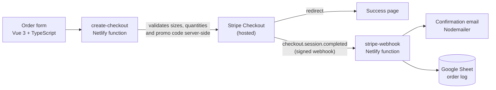

# online-storefront

[](https://github.com/monahand1023/online-storefront/actions/workflows/test.yml) [](https://vuejs.org/) [](https://www.typescriptlang.org/) [](https://docs.netlify.com/functions/overview/) [](https://docs.stripe.com/payments/checkout) [](LICENSE)

A minimal, deployable storefront for small selling events: an order form, Stripe Checkout, and a webhook that emails the customer and logs the order to a Google Sheet. No database, no admin panel, no always-on server.

I built it for my kid's school, which needed an ordering portal for an event t-shirt sale, then generalized it so anyone can fork it, edit one config file, and deploy to Netlify.

## How it works



Post-payment side effects run from the signed Stripe webhook, never from the browser, so a closed tab or a refresh cannot lose an order.

## Tech stack

| Layer | Choice |
|---|---|
| Frontend | Vue 3, TypeScript, Vite, Vue Router |
| Payments | Stripe Checkout (hosted) with signed webhooks |
| Backend | Netlify serverless functions (Node) |
| Email | Nodemailer over SMTP |
| Order log | Google Sheets API via a service account |
| Tests | Vitest |

## Project Structure

```
├── netlify/
│   └── functions/              # Serverless functions
│       ├── create-checkout.js  # Stripe checkout session creation
│       ├── get-session.js      # Retrieve session details
│       ├── log-to-sheets.js    # Google Sheets logging
│       ├── send-email.js       # Email notifications
│       └── stripe-webhook.js   # Stripe webhook (email + logging on payment)
├── src/
│   ├── assets/                 # Static assets
│   ├── config/
│   │   └── store.ts            # Product config: pickup dates, sizes, price
│   ├── router/                 # Vue Router configuration
│   ├── services/
│   │   └── googleSheetsLogger.ts
│   ├── tests/                  # Vitest unit tests
│   └── views/
│       ├── HomeView.vue        # Main order form
│       └── SuccessView.vue     # Order confirmation
├── .env.example               # Required environment variables (template)
├── netlify.toml               # Netlify configuration + security headers
└── package.json               # Project dependencies
```

## Core Components

### HomeView.vue
- Main ordering interface
- Features:
  - Multiple shirt size/quantity selection
  - Student information collection
  - Pickup details
  - Promo code support (40% discount — validated server-side)
  - Stripe checkout integration

### SuccessView.vue
- Order confirmation page
- Displays order summary from Stripe session data
- Post-payment side effects (email, Sheets logging) are handled by the Stripe webhook, not the browser

## Serverless Functions

### create-checkout.js
- Creates Stripe checkout session
- Server-side input validation: size allowlist, quantity range 1–10, control-char stripping
- Server-side promo code validation against `DISCOUNT_CODE` env var

### get-session.js
- Retrieves Stripe session details
- Used to display order confirmation after redirect

### stripe-webhook.js
- Receives `checkout.session.completed` events from Stripe
- Sends confirmation email and logs to Google Sheets when `payment_status === 'paid'`
- Email/logging errors do not fail the webhook (Stripe retry safety)

### log-to-sheets.js
- Logs order details to Google Sheets
- Tracks order details, customer information, payment status, and pickup information

### send-email.js
- Sends confirmation emails to the customer (CC to admin)
- Includes order summary and pickup instructions

## Environment Variables

Copy `.env.example` to `.env` and fill in your values:

```bash
cp .env.example .env
```

Key variables:

| Variable | Where to set | Purpose |
|---|---|---|
| `STRIPE_SECRET_KEY` | Netlify dashboard | Stripe API secret |
| `STRIPE_WEBHOOK_SECRET` | Netlify dashboard | Stripe webhook signature verification |
| `DISCOUNT_CODE` | Netlify dashboard | Promo code for 40% discount (server-side only) |
| `SMTP_HOST` / `SMTP_PORT` / `SMTP_USER` / `SMTP_PASSWORD` | Netlify dashboard | Email sending |
| `GOOGLE_SERVICE_ACCOUNT_CREDENTIALS` | Netlify dashboard | Google Sheets API (full JSON key) |
| `GOOGLE_SPREADSHEET_ID` | Netlify dashboard | Target spreadsheet |
| `VITE_STRIPE_PUBLISHABLE_KEY` | Netlify dashboard | Stripe publishable key (safe for browser) |

**Important:** Never use the `VITE_` prefix for secrets. Any `VITE_` variable is bundled into the browser JavaScript bundle and is publicly visible.

## Deployment Instructions

1. **Prerequisites**
   - Node.js 20 or newer
   - Netlify CLI installed
   - Stripe account
   - Google Cloud account with Sheets API enabled
   - SMTP email service

2. **Local Development Setup**
   ```bash
   # Install dependencies
   npm install

   # Create .env file with required variables
   cp .env.example .env

   # Start development server
   npm run dev
   ```

3. **Netlify Deployment**
   ```bash
   # Login to Netlify
   netlify login

   # Initialize Netlify site
   netlify init

   # Deploy
   netlify deploy --prod
   ```

4. **Stripe Webhook Setup** (required for email confirmations and order logging)

   After deploying:
   - Go to [Stripe Dashboard → Developers → Webhooks](https://dashboard.stripe.com/webhooks)
   - Click **Add endpoint**
   - Set the endpoint URL to:
     ```
     https://YOUR_NETLIFY_URL/.netlify/functions/stripe-webhook
     ```
   - Select the event: `checkout.session.completed`
   - Copy the **Signing secret** (`whsec_...`) and add it as `STRIPE_WEBHOOK_SECRET` in your Netlify environment variables

5. **Post-Deployment Setup**
   - Configure all environment variables in the Netlify dashboard
   - Configure Google Sheets API credentials
   - Test a checkout end-to-end

## Running Tests

```bash
npm test
```

Tests cover: size validation, quantity validation, control-character sanitization, discount code matching, and webhook handler logic (including signature failure, paid/unpaid branching, and error resilience).

## Configuration

### Pickup Dates and Product Config

Edit `src/config/store.ts` to update pickup dates, price, sizes, or programs. Changes take effect on the next build — no hunting through component files.

### Discount System
- 40% discount available with a promo code
- The code is validated **server-side only** against the `DISCOUNT_CODE` environment variable
- The discount code is never exposed in the browser bundle

### Order Limits
- Up to 5 shirts per size selector (configurable in HomeView.vue)
- Maximum 10 per size enforced server-side
- Multiple sizes per order supported

## Security

- Stripe handles all payment card information
- Discount validation is entirely server-side — the discount code is never bundled into frontend JS
- All serverless functions return generic error messages to clients; full error details are logged server-side only
- Content Security Policy, X-Frame-Options, X-Content-Type-Options, and Referrer-Policy headers are set in `netlify.toml`
- Server-side validation for all inputs: size allowlist, integer quantity range, control-character stripping

## Maintenance and Monitoring

### Order Tracking
- All orders logged to Google Sheets via the Stripe webhook
- Includes payment status, customer details, and pickup information

### Error Handling
- Failed payments tracked in Stripe dashboard
- Webhook errors logged in Netlify function logs
- Google Sheets logging errors captured without failing the webhook

## License

MIT — see [LICENSE](LICENSE).
